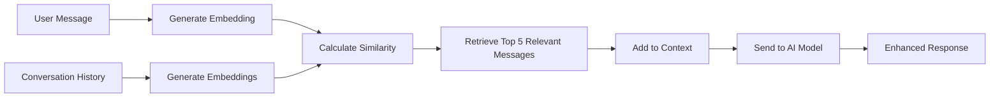

## Overview

PolyChat-AI includes RAG (Retrieval-Augmented Generation) capabilities to enhance AI responses with relevant context from your conversation history. Using local embeddings, the system retrieves semantically similar previous messages to provide better, more contextual responses.

<Info>
**Privacy-First**: All RAG processing happens locally in your browser using WebAssembly. No conversation data is sent to external services for embedding generation.
</Info>

## How It Works

### Architecture



### Technical Stack

<CardGroup cols={2}>
  <Card title="Embeddings Model" icon="brain">
    **all-MiniLM-L6-v2** by Sentence Transformers
    
    - 384-dimensional vectors
    - Optimized for semantic similarity
    - Fast inference in browser
  </Card>
  
  <Card title="Framework" icon="code">
    **@xenova/transformers**
    
    - Transformers.js for browser ML
    - WebAssembly acceleration
    - No external API calls
  </Card>
</CardGroup>

## Implementation

### Core RAG Service

From `src/services/ragService.ts`:

```typescript
import { pipeline, cos_sim, FeatureExtractionPipeline } from '@xenova/transformers';
import type { Message } from '../types';

// Singleton class to ensure we only load the model once
class EmbeddingService {
  private static instance: FeatureExtractionPipeline | null = null;

  static async getInstance() {
    if (this.instance === null) {
      // Load the embedding model (happens once per session)
      this.instance = (await pipeline(
        'feature-extraction',
        'Xenova/all-MiniLM-L6-v2'
      )) as FeatureExtractionPipeline;
    }
    return this.instance;
  }
}
```

### Embedding Generation

```typescript
// Function to calculate embeddings for a batch of texts
async function getEmbeddings(texts: string[]): Promise<number[][]> {
  const extractor = await EmbeddingService.getInstance();
  
  const embeddings = await Promise.all(
    texts.map(async (text) => {
      const embedding = await extractor(text, { 
        pooling: 'mean',    // Mean pooling over tokens
        normalize: true     // L2 normalization
      });
      return embedding.tolist();
    })
  );
  
  return embeddings;
}
```

### Context Retrieval

```typescript
// Main function to get relevant context
export async function getRelevantContext(
  query: string,              // Current user message
  history: Message[],         // All previous messages
  maxMessages: number = 5     // Number of messages to retrieve
): Promise<Message[]> {
  if (history.length === 0) {
    return [];
  }

  // Prepare texts for embedding
  const queryText = query;
  const historyTexts = history.map(
    (msg) => `${msg.role}: ${msg.content}`
  );

  // Generate embeddings
  const [queryEmbedding, ...historyEmbeddings] = 
    await getEmbeddings([queryText, ...historyTexts]);

  // Calculate similarities using cosine similarity
  const similarities = historyEmbeddings.map((histEmbedding) =>
    cos_sim(queryEmbedding, histEmbedding)
  );

  // Get indices of top N most similar messages
  const topIndices = similarities
    .map((similarity, index) => ({ similarity, index }))
    .sort((a, b) => b.similarity - a.similarity)
    .slice(0, maxMessages)
    .map((item) => item.index);

  // Retrieve the most relevant messages and sort chronologically
  const relevantMessages = topIndices
    .map((index) => history[index])
    .sort((a, b) => a.timestamp.getTime() - b.timestamp.getTime());

  return relevantMessages;
}
```

## Features

### Semantic Similarity Search

**Not just keyword matching** - understands meaning:

<Tabs>
  <Tab title="Example 1: Synonyms">
    ```text
    Query: "How do I optimize database performance?"
    
    Retrieved messages (by semantic similarity):
    1. "Ways to speed up SQL queries" (similarity: 0.85)
    2. "Database indexing best practices" (similarity: 0.82)
    3. "Improving query response time" (similarity: 0.78)
    
    Note: No exact keyword match required!
    ```
  </Tab>
  
  <Tab title="Example 2: Context">
    ```text
    Query: "What was the solution we discussed?"
    
    Retrieved messages:
    1. "The fix was to add an index on the user_id column" (0.88)
    2. "We decided to use Redis for caching" (0.76)
    3. "Implementing connection pooling helped" (0.71)
    
    Understands "solution" relates to previous fixes and decisions.
    ```
  </Tab>
  
  <Tab title="Example 3: Related Topics">
    ```text
    Query: "Tell me about API authentication"
    
    Retrieved messages:
    1. "Using JWT tokens for auth" (similarity: 0.91)
    2. "OAuth2 implementation details" (similarity: 0.87)
    3. "Securing REST endpoints" (similarity: 0.79)
    4. "Password hashing with bcrypt" (similarity: 0.75)
    
    Finds related authentication topics, not just exact matches.
    ```
  </Tab>
</Tabs>

### Local Processing

**Complete privacy** - everything runs in your browser:

```typescript
// Model loading and inference happens locally
const extractor = await pipeline(
  'feature-extraction',
  'Xenova/all-MiniLM-L6-v2',
  {
    // Model is downloaded once and cached in browser
    // Subsequent loads are instant
    progress_callback: (progress) => {
      console.log(`Loading: ${progress.progress}%`);
    }
  }
);
```

**Benefits**:
- No API calls for embeddings
- No data leaves your device
- No additional costs
- Works offline (after initial model download)
- Fast inference (~50ms per message)

### Smart Context Selection

**Retrieves up to 5 most relevant messages**:

```typescript
const relevantContext = await getRelevantContext(
  currentMessage,
  conversationHistory,
  5  // maxMessages - configurable
);

// Returns messages sorted by:
// 1. Semantic similarity (highest first)
// 2. Then chronologically (for context flow)
```

**Why 5 messages?**
- Balance between context and token usage
- Enough context for most conversations
- Prevents context window overflow
- Configurable if needed

## Configuration

### Enable/Disable RAG

```text
Settings → Advanced → RAG (Context Enhancement)

[ ] Enable RAG for enhanced context
```

**When to Enable**:
- ✅ Long conversations with multiple topics
- ✅ Need to reference earlier discussions
- ✅ Complex problem-solving over time
- ✅ Want AI to remember context automatically

**When to Disable**:
- ❌ Short, simple queries
- ❌ Each message is independent
- ❌ Browser performance concerns
- ❌ Want faster response times

### Performance Considerations

<CardGroup cols={2}>
  <Card title="Initial Load" icon="download">
    **~25MB model download** (one-time)
    
    - Cached in browser
    - Only on first use
    - Automatic background loading
  </Card>
  
  <Card title="Inference Speed" icon="zap">
    **~50ms per message**
    
    - Fast enough for real-time
    - Minimal impact on UX
    - WebAssembly accelerated
  </Card>
  
  <Card title="Memory Usage" icon="cpu">
    **~100MB additional RAM**
    
    - Model in memory
    - Embeddings cached
    - Acceptable for modern browsers
  </Card>
  
  <Card title="Context Quality" icon="sparkles">
    **Significantly better responses**
    
    - Relevant history included
    - Coherent long conversations
    - Better understanding
  </Card>
</CardGroup>

## Use Cases

### 1. Long Technical Discussions

<Steps>
  <Step title="Problem Introduction">
    "I'm having issues with my React app's performance"
  </Step>
  
  <Step title="Diagnosis">
    "It seems to lag when scrolling through lists"
    
    AI gets context about the React app and scrolling issues.
  </Step>
  
  <Step title="Solution Exploration">
    "I tried using useMemo but it didn't help"
    
    RAG retrieves previous messages about React and performance.
  </Step>
  
  <Step title="Follow-up Question">
    "What was that virtualization library you mentioned?"
    
    RAG finds the earlier message mentioning react-window, even if it was 20 messages ago.
  </Step>
</Steps>

### 2. Project Planning

```text
Message 1: "We need to build a user authentication system"
Message 5: "Let's use JWT tokens for sessions"
Message 12: "Should we implement OAuth for social login?"
Message 20: "What database should we use for user data?"

Message 30: "Remind me what we decided about authentication?"

RAG retrieves:
- Message 1 (authentication system)
- Message 5 (JWT tokens decision)  
- Message 12 (OAuth consideration)

AI: "Based on our earlier discussion, we decided to build a JWT-based
authentication system with OAuth for social login..."
```

### 3. Code Review Across Sessions

```typescript
// Earlier conversation (Session 1)
"Here's my API endpoint code: [code snippet]"
"The issue is rate limiting isn't working"

// Later conversation (Session 2 - different day)
"I want to add caching to that API endpoint we reviewed"

RAG retrieves:
- Original API code
- Rate limiting discussion
- Provides context for caching implementation
```

## Advanced Usage

### Adjusting Number of Retrieved Messages

Modify in your code:

```typescript
import { getRelevantContext } from './services/ragService';

// Get more context for complex topics
const context = await getRelevantContext(
  userMessage,
  conversationHistory,
  10  // Retrieve 10 instead of default 5
);

// Get less context for simple queries
const lightContext = await getRelevantContext(
  userMessage,
  conversationHistory,
  3  // Just top 3 most relevant
);
```

### Similarity Threshold

Filter by minimum similarity:

```typescript
const relevantMessages = await getRelevantContext(
  query,
  history,
  5
);

// Filter by similarity threshold
const highQualityContext = relevantMessages.filter((msg, idx) => {
  const similarity = similarities[idx];
  return similarity > 0.7;  // Only include if >70% similar
});
```

### Custom Embeddings

For specialized domains, you could swap the model:

```typescript
// Example: Use a different embedding model
class CustomEmbeddingService {
  static async getInstance() {
    return await pipeline(
      'feature-extraction',
      'your-org/specialized-model'  // Domain-specific model
    );
  }
}
```

## Best Practices

<AccordionGroup>
  <Accordion title="When to Use RAG">
    **Ideal Scenarios**:
    - Conversations spanning multiple sessions
    - Complex problem-solving requiring history
    - Technical support or debugging
    - Project planning and decision tracking
    - Learning sessions with progressive topics
    
    **Not Necessary For**:
    - Single-question queries
    - Independent tasks
    - Template-based conversations
    - Quick factual questions
  </Accordion>
  
  <Accordion title="Optimizing Performance">
    **Reduce Initial Load Time**:
    - Model loads on first RAG usage
    - Pre-load if you know you'll need it
    - Cache is persistent across sessions
    
    **Manage Memory**:
    - Disable RAG for simple conversations
    - Clear old conversations periodically
    - Close unused tabs
    
    **Improve Accuracy**:
    - Use clear, descriptive messages
    - Keep conversations focused
    - Start new chats for different topics
  </Accordion>
  
  <Accordion title="Understanding Limitations">
    **Model Constraints**:
    - Works best with English text
    - Limited to conversation history (no external docs)
    - Semantic similarity is probabilistic
    - May retrieve unexpected matches
    
    **Context Window**:
    - Only retrieves top 5 messages by default
    - Very old messages may not be retrieved
    - Token limits still apply to final prompt
    
    **Processing Time**:
    - Adds ~50-100ms per message
    - Acceptable for most use cases
    - May be noticeable on slow devices
  </Accordion>
</AccordionGroup>

## Technical Details

### Model Information

**all-MiniLM-L6-v2**:
- **Size**: ~25MB
- **Dimensions**: 384
- **Max Sequence Length**: 256 tokens
- **Performance**: 50-100ms per embedding
- **Accuracy**: 0.85+ on semantic similarity tasks

### Cosine Similarity

```typescript
// How similarity is calculated
const cosineSimilarity = (vecA: number[], vecB: number[]): number => {
  const dotProduct = vecA.reduce((sum, a, i) => sum + a * vecB[i], 0);
  const magnitudeA = Math.sqrt(vecA.reduce((sum, a) => sum + a * a, 0));
  const magnitudeB = Math.sqrt(vecB.reduce((sum, b) => sum + b * b, 0));
  return dotProduct / (magnitudeA * magnitudeB);
};

// Returns value between -1 and 1:
// 1.0 = identical
// 0.0 = unrelated
// -1.0 = opposite (rare in practice)
```

### Integration with Chat

```typescript
// Simplified flow in chat hook

const sendMessage = async (message: string) => {
  let contextMessages = [];
  
  // If RAG is enabled
  if (settings.ragEnabled) {
    // Get relevant context
    contextMessages = await getRelevantContext(
      message,
      conversationHistory,
      5
    );
  }
  
  // Build final message array
  const messages = [
    ...contextMessages,        // Relevant history
    { role: 'user', content: message }  // Current message
  ];
  
  // Send to AI
  const response = await streamAIResponse(
    messages,
    apiKey,
    model,
    onChunk,
    systemPrompt
  );
};
```

## Future Enhancements

<Info>
These features are planned for future releases:

- **Document Upload**: Embed and search your own documents
- **Cross-Conversation Search**: Search across all conversations
- **Custom Embedding Models**: Use specialized domain models
- **Hybrid Search**: Combine semantic + keyword search
- **Context Visualization**: See which messages were retrieved and why
</Info>

## Troubleshooting

<AccordionGroup>
  <Accordion title="RAG is slow on first use">
    **Cause**: Model download (~25MB)
    
    **Solution**:
    - Wait for initial download (one-time)
    - Model is cached for future sessions
    - Subsequent uses are instant
  </Accordion>
  
  <Accordion title="Not retrieving expected messages">
    **Possible Causes**:
    - Messages are semantically different than expected
    - Other messages are more similar
    - Message is beyond top 5 results
    
    **Solutions**:
    - Use more specific language
    - Increase maxMessages parameter
    - Check similarity scores in console (if debugging)
  </Accordion>
  
  <Accordion title="Browser performance issues">
    **Symptoms**: Lag, high memory usage
    
    **Solutions**:
    - Disable RAG for simple conversations
    - Clear old conversations
    - Close other tabs
    - Use a more powerful device
  </Accordion>
  
  <Accordion title="RAG not working at all">
    **Checklist**:
    - Is RAG enabled in settings?
    - Is there conversation history?
    - Check browser console for errors
    - Try refreshing the page
    - Clear browser cache if model is corrupted
  </Accordion>
</AccordionGroup>

---

## Summary

PolyChat-AI's RAG implementation provides:

✅ **Privacy-first** local embeddings
✅ **Semantic search** beyond keywords  
✅ **Automatic context** enhancement
✅ **Zero cost** - no API calls
✅ **Fast inference** - ~50ms per message
✅ **Easy to use** - toggle in settings

Built on:
- `@xenova/transformers` for browser ML
- `all-MiniLM-L6-v2` embedding model
- Cosine similarity for relevance
- Smart context selection (top 5 messages)

<Card title="Back to Features" icon="arrow-left" href="/features">
  Explore other core features of PolyChat-AI
</Card>